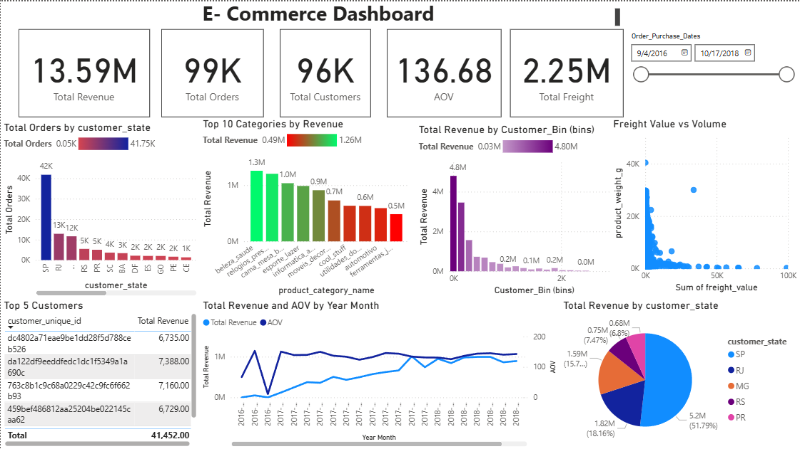

# 🛒 E-Commerce Analytics Dashboard (Olist Dataset)
## 📌 Project Overview

This project analyzes the Olist Brazilian E-Commerce Dataset using SQL and Power BI to uncover insights into revenue performance, customer behavior, product category performance, geographic sales distribution, and logistics costs.

The objective was to simulate a real-world Data Analyst workflow:
```
Raw Data
   ↓
SQL Analysis
   ↓
Business Insights
   ↓
Interactive Power BI Dashboard
```
## Skills Demonstrated: 
**SQL**: INNER JOIN, GROUP BY, CTEs, Window Functions, LAG(), Running Totals, Revenue Contribution Analysis, Pareto Analysis, Customer Analytics, Time Series Analysis.

**Power BI**: Data Modeling, Relationships, DAX Measures, KPI Reporting, Interactive Dashboards, Bar Charts, Line Charts, Pie Charts, Scatter Plots, Slicers


## 🎯 Business Questions

This project answers the following business questions:

**Revenue & Performance**
  * What is the total revenue generated?
  * How many orders and customers does the business have?
  * What is the Average Order Value (AOV)?
  * How has revenue changed over time?

**Product Analysis**
  * Which product categories generate the most revenue?
  * Do a small number of categories contribute most of the revenue?

**Customer Analysis**
  * Who are the highest-spending customers?
  * Is revenue concentrated among a small group of customers?
  * How frequently do customers purchase?
  * When did customers last make a purchase?

**Geographic Analysis**
  * Which Brazilian states contribute the most orders?
  * Which states contribute the most revenue?
  * Logistics Analysis
  * How much freight revenue is associated with orders?
  * Is there a relationship between freight charges and product size/weight?

## 📂 Dataset

The project uses the Olist Brazilian [E-Commerce Dataset](https://www.kaggle.com/datasets/olistbr/brazilian-ecommerce?resource=download) containing:

  * ~100,000 Orders
  * ~96,000 Customers
  * Product Information
  * Order Payments
  * Order Items
  * Customer Locations
    
Tables Used:
```
customers
orders
order_items
order_payments
products
```

## SQL Analysis
**1. KPI Reporting**
Calculated: 
  * Total Revenue
  * Total Orders
  * Total Customers
  * Average Order Value (AOV)

**2. Revenue Trend Analysis**
Analyzed monthly revenue trends and month-over-month changes using `LAG()` to identify revenue growth patterns over time

**3. Product Category Analysis**
Calculated:
  * Revenue by Category
  * Orders by Category
  * Average Revenue per order

**4. Pareto Analysis**
Used:
```
CTE
SUM() OVER()
```
to determine whether a small number of categories generated the majority of revenue.

**5. Customer Revenue Analysis**
Identified:
  * Highest-spending customers
  * Revenue contribution by customer
using ranking and aggregation techniques.

**6. Customer Contentration Analysis**
Calculated cumulative revenue contribution to evaluate revenue concentration among customers.

**7. Customer Recency Analysis**
Determined the most recent purchase date for each customer

**8. Customer Frequency Analysis**
Calculated: `Orders per customer` to understand repeat purchasing behaviour

**9. Geographic Analysis**
Evaluated:
  * Orders by State
  * Revenue by State
to identify high-performing regions.

## Dashboard Overview

The Power BI dashboard provides an interactive overview of business performance.

| Metric                | Value  |
| --------------------- | ------ |
| Total Revenue         | 13.59M |
| Total Orders          | 99K    |
| Total Customers       | 96K    |
| Average Order Value   | 136.68 |
| Total Freight Charges | 2.25M  |

**Dashboard Preview**


## Key Insights
**Revenue Performance**
  * Generated over 13.5M in revenue from approximately 99k orders.
  * Average Order Value remained over 136.68
    
**Geographic Trends**
  * SP accounted for the highest share of both orders and revenue
  * Revenue Distribution is highly skewed with small group of customers contributing disproportionately to sales.
  * Most customes make relatively few purchases.
    
**Logistics**
  * Total Freight Charges exceeded 2.25M.
  * Freight charges do not appear to be determined solely by product size, indicating additional factors like distance and shipping conditions.

## Recomendations


